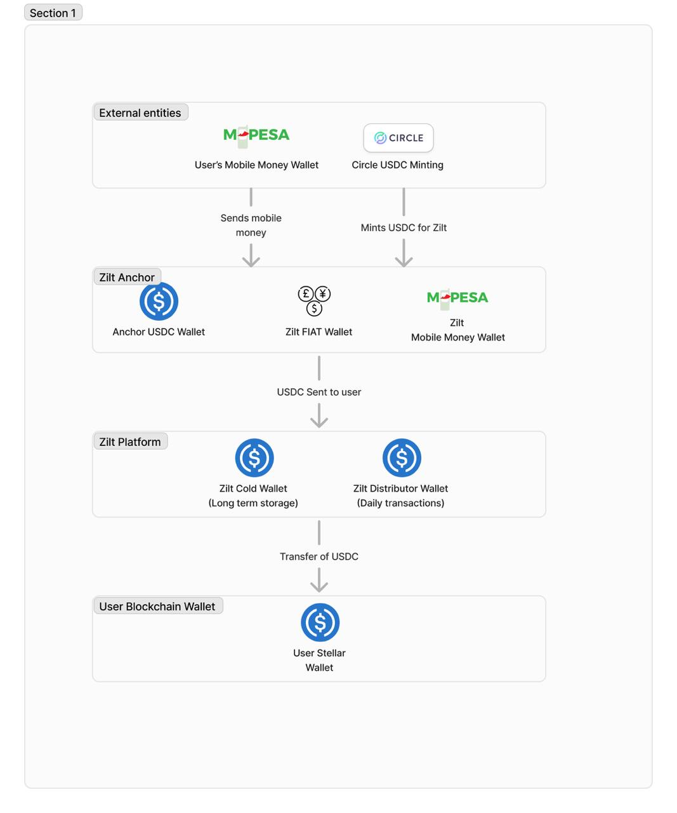

# Zilt – A Digital Dollar Wallet for Zimbabwe

Zilt is Zimbabwe's solution to physical USD shortages. Built on the Stellar blockchain and powered by Supabase and Passkey-Kit, Zilt enables users to instantly access and spend digital dollars (USDC) using only their mobile number and EcoCash (mobile money). With seamless onboarding, biometric security, and real-time updates, Zilt is the first mobile wallet in Zimbabwe to offer digital dollar accounts to the masses.

---

## 🚀 The Narrative "Why"

### Problem Statement
Zimbabwe faces chronic shortages of physical USD, driving demand for stable, reliable digital alternatives. Traditional banking systems are inaccessible to many and often involve high friction, fees, and delays.

### User Base
- Everyday Zimbabweans in need of reliable USD access
- Micro and small businesses transacting in digital dollars
- Remittance recipients seeking fast, stable value transfers

### Impact
Zilt democratizes access to digital dollars via an intuitive mobile interface. Users can convert EcoCash (fiat) into USDC instantly, enabling savings, payments, and remittances without relying on volatile local currency or cash scarcity.

### Why Stellar?
Stellar’s fast, low-cost settlement layer, combined with Passkey-Kit’s seamless WebAuthn onboarding and wallet management, allowed us to build a banking-grade platform in weeks. Passkeys abstract away key management, while Stellar’s USDC support ensures real-time, trusted cross-border value transfers.

### Experience Building on Stellar
Stellar’s ecosystem tools—SDKs, testnet, launchtube, and developer documentation—were instrumental. We used Passkey-Kit to handle auth and transaction signing, and deployed smart contracts via Soroban to enable future programmable logic for remittances and cross-currency settlements.

---

## ✅ MVP – Minimal Viable Product

> 🔗 GitHub Repo: [https://github.com/Cliv3/ZiltMobileApp](https://github.com/Cliv3/ZiltMobileApp)
> 🌐 Deployed Frontend: [https://ziltapp.netlify.app](https://ziltapp.netlify.app)

---

## 🛠️ Technologies Used

| Tech            | Purpose                                               |
|-----------------|-------------------------------------------------------|
| **Stellar SDK** | USDC settlement, wallet interaction, smart contracts |
| **Passkey-Kit** | WebAuthn wallet creation, passkey auth                |
| **Supabase**    | Auth, real-time DB sync, edge functions               |
| **React + TS**  | Frontend, state management, transaction UX           |
| **Zustand**     | Centralized app state                                 |
| **PostgreSQL**  | Financial data & transaction storage                  |
| **LaunchTube**  | Stellar contract deployment pipeline                  |

---

## 🔧 Features Implemented

- ✅ Seamless user registration with passkey (WebAuthn)
- ✅ Automated Stellar wallet creation on signup
- ✅ Load USD via EcoCash (mobile money)
- ✅ Real-time transaction updates using Supabase Realtime
- ✅ Send and receive USDC to/from Stellar accounts
- ✅ Biometric login with secure enclave key storage
- ✅ Dynamic fee calculation on withdrawals (0.2%)
- ✅ Zero-knowledge memos using Supabase Vault
- ✅ Responsive mobile-first UI built in React

---

## 📐 Technical Design Docs

### System Overview
Zilt is architected as a hybrid fiat–crypto wallet system. Fiat onramps (e.g., EcoCash) are converted to USDC via a backend bridge. Stellar serves as the final settlement layer. Passkey-Kit creates and manages wallets, and Supabase powers all backend services.

### Key Components
1. **Frontend**: React/TS app for all wallet features.
2. **Backend**: Supabase DB + Edge Functions for fees, balance updates, and user KYC metadata.
3. **Auth**: Passkey-Kit manages biometric login and secures keys.
4. **Blockchain Layer**: Stellar USDC payments + future Soroban contract support.

### Design Decisions
- Used Supabase Realtime to avoid polling and cut infra complexity.
- Chose Passkey-Kit to eliminate seed phrases and reduce onboarding friction.
- Integrated PostgreSQL triggers for atomic updates and audit trails.

### Tradeoffs
- Opted for managed backend (Supabase) over custom infra for speed.
- Delayed full Soroban smart contract logic to focus on core payments first.

### Challenges
- Balancing fiat UX expectations with decentralized blockchain logic.
- Managing transaction atomicity and fee precision across USD/fiat.
- Educating non-crypto users about stablecoins without complexity.

---

## 🏁 Deployment Status

- ✅ Wallet smart contracts deployed to Stellar testnet
- ✅ Passkey integration live
- ✅ USDC bridge operational for testnet transactions
- ✅ Demo available at [https://ziltapp.netlify.app](https://ziltapp.netlify.app)
---

## 📄 License

MIT License. See [LICENSE](LICENSE) for details.

